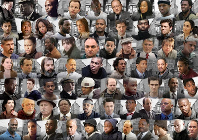

# The Wire

**The·Wire**  */ˈTheˌWire/*

*Noun:*  
A one-hour HBO drama set and produced in Baltimore Maryland.

*Synonyms:*	
Breaking Bad, Game of Thrones.

## Description

A personal project of mine. I want to take the story of the wire and map it onto a 'Graph Database'

I'll be updating this repo as I go so the README will change.

I'm starting off small and working my way out.

## Links

## Development Info

